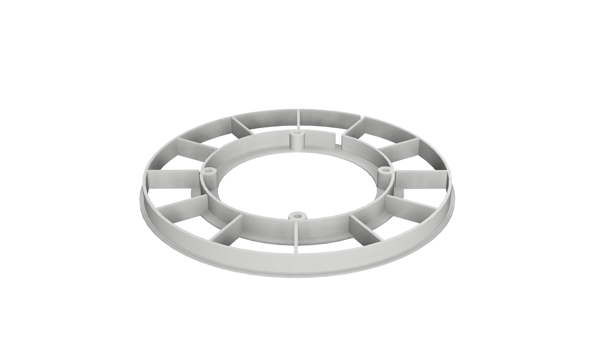
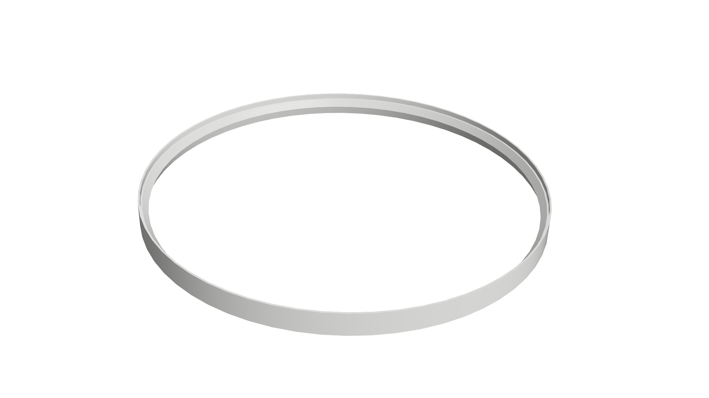

# CAD data for RingClock

This folder contains the CAD and STL files for the RingClock parts that should be printed with a 3D printer.
The CAD files can be edited with Autodesk Fusion 360.

## Printer Settings

To ensure optimal printing results, please use the following printer settings:

- Filament: White PLA
- Layer Height: 0.2 mm
- Infill Density: 50%
- Support Material: none
- Raft/Brim: BRIM

## Pictures

RingClock Center             |  RingClock Outer Ring
:-------------------------:|:-------------------------:
 | 

